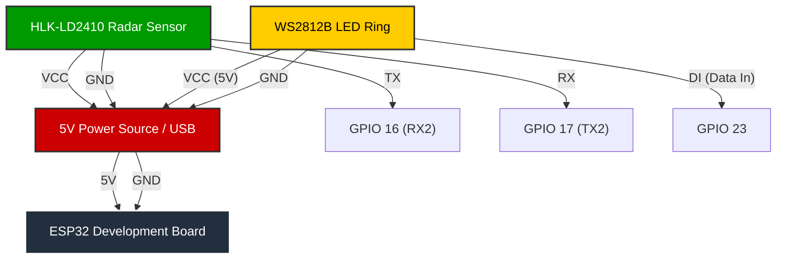

# Focus-Distraction Detector (Deep Work Guardian)

A smart mmWave radar monitor that helps you stay focused and take regular breaks. Built with an ESP32, HLK-LD2410B sensor, and a WS2812 LED ring.

## 🧐 The Problem
You're in a "flow state," completely focused on a complex coding problem, and a colleague or family member taps you on the shoulder. Your concentration is shattered.

Open-plan offices and home-office setups make us vulnerable to these well-meaning but disruptive interruptions. A simple "busy" sign is easy to miss. This project creates an active visual warning that alerts you before you get startled, giving you a moment to pause your work and turn around.

## 💡 The Solution
Unlike standard PIR sensors that just detect motion, this mmWave radar project uses **Range Gating** logic:
1.  **Smart User Zone:**  It creates a dedicated "User Zone" (0-1.5m) where your presence is monitored for focus (turning Green), distinguishing you from the rest of the room.
2.  **Detects Intruders:** It scans a "Distraction Zone" (1.5m-3m) behind you.
3.  **Active Warning:** If someone breaches the perimeter, the LED ring flashes a visual alert, giving you time to turn around before being startled.
4.  **Break Timer:** Includes a "52/17" rule timer to remind you to take breaks after 52 minutes of deep work.

## 🛠️ Hardware Required
* **Microcontroller:** ESP32 Development Board (WROOM-32).
* **Sensor:** Hi-Link HLK-LD2410B (Bluetooth version recommended for easy tuning).
* **Visual:** WS2812B RGB LED Ring (Neopixel).
* **Power:** 5V Power Supply (2A USB charger).
* **Misc:** Breadboard, Jumper wires.

## 🔌 Wiring

| HLK-LD2410 Pin | ESP32 Pin | Note |
| :--- | :--- | :--- |
| VCC | 5V | |
| GND | GND | |
| TX | GPIO 16 (RX2) | |
| RX | GPIO 17 (TX2) | |

| LED Ring Pin | ESP32 Pin | Note |
| :--- | :--- | :--- |
| VCC | 5V | |
| GND | GND | |
| Data In (DI) | GPIO 23 | |

**Note:** The LED ring and sensor can draw significant power. Ensure your 5V source is stable.

## ⚙️ Sensor Configuration
Before running the code, you must configure the sensor zones using the **HLKRadarTool** mobile app:
1.  **Gate 0 (0-0.75m) & Gate 1 (0.75-1.5m):** Set sensitivity to **0** (Disabled). This creates the "Ignore/User Zone".
2.  **Gate 2 (1.5-2.25m) & Gate 3 (2.25-3.0m):** Set sensitivity to **High (e.g., 80)**. This is your "Trigger Zone".

## 💻 Logic & Features
The code implements three priority levels:
* **Priority 1 (Proximity Alert):** * 3m - 2m: Blue Alert.
    * 2m - 1.5m: Yellow Alert.
    * < 1.5m: Red Alert.
* **Priority 2 (Break Reminder):** Triggers a Purple alert if you have been focused for 52 minutes.
* **Priority 3 (Focus Monitoring):** Monitors energy levels in the distraction zone to detect subtle movements.

## 📚 Libraries Used
* [LD2410](https://github.com/ncmreynolds/ld2410) by ncmreynolds.
* [Adafruit NeoPixel](https://github.com/adafruit/Adafruit_NeoPixel).

## 📄 License
This project is open-source and available under the MIT License.
